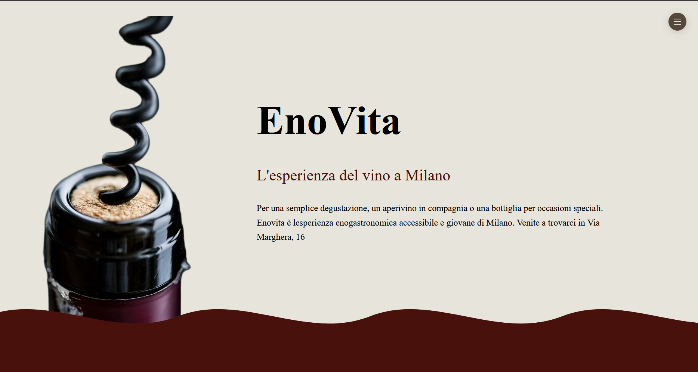
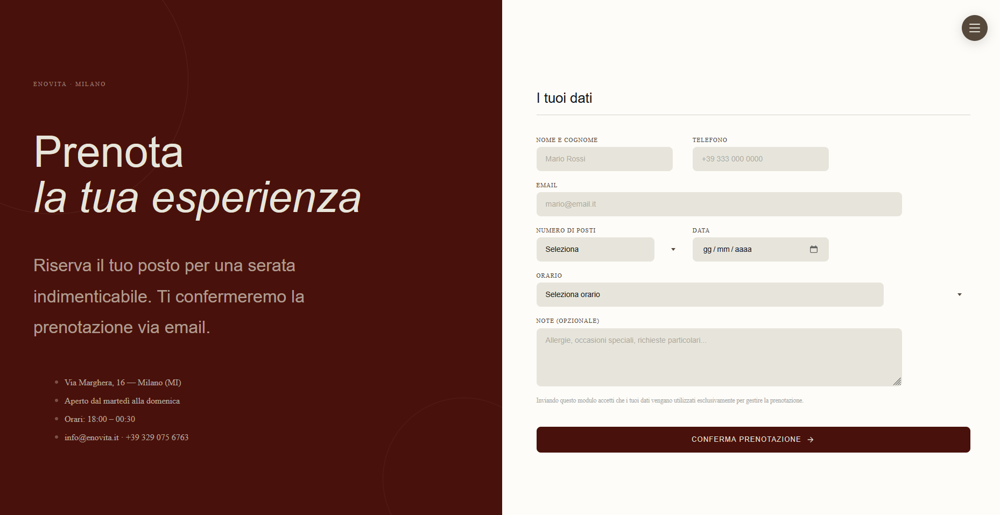
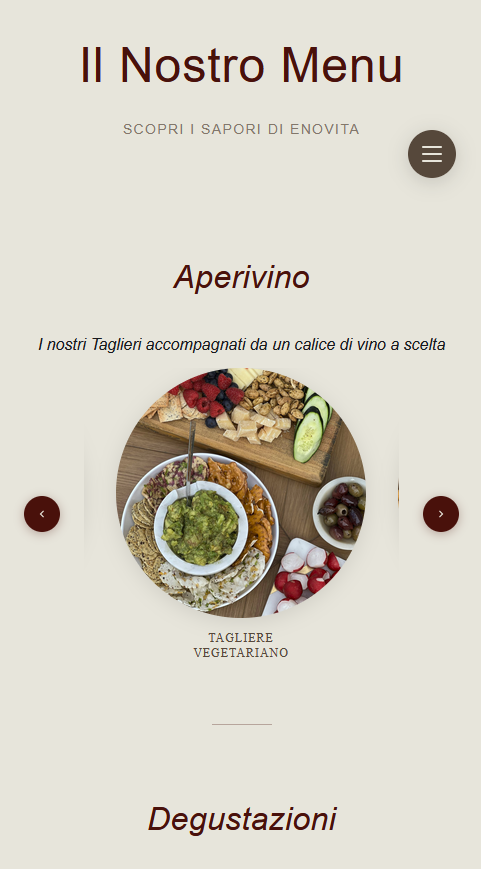

# Enovita — Sito Web

Sito web per **Enovita**, un enobar giovane e accessibile nel cuore di Milano. Progetto frontend sviluppato con HTML, SCSS e JavaScript vanilla.

---

## Alcuni Screenshot
---

---

---

---

## Funzionalità principali

### Homepage
- **Effetto onda vino** — il liquido rosso sale dinamicamente mentre si scrolla la pagina, creato con SVG animato e scroll listener in JavaScript
- **Menu hamburger floating draggabile** — bottone FAB posizionabile liberamente nello schermo con supporto drag & drop
- **Sezione vini** con hover interattivo — le bottiglie scivolano fuori schermo rivelando la descrizione del vino
- **Responsive mobile** — su mobile l'immagine hero viene sfocata e traslata come sfondo, con il testo sovrapposto in primo piano

### Pagina Menu
- Tre sezioni — Aperivini, Degustazioni, I Vini
- **Caroselli circolari** navigabili con frecce
- Overlay con descrizione e prezzo al click su ogni elemento

### Form Prenotazione
- Campi: nome, telefono, email, numero posti, data, orario, note
- **Validazione HTML5** nativa
- **Invio email doppio via EmailJS** — notifica al gestore + conferma automatica all'utente
- Messaggio di successo animato dopo l'invio

---

## Tecnologie

| Tecnologia | Utilizzo |
|------------|----------|
| HTML5 | Struttura semantica delle pagine |
| SCSS | Styling con variabili, mixin, partial |
| JavaScript ES6+ | Animazioni, scroll listener, drag & drop, DOM manipulation |
| EmailJS | Invio email lato client senza backend |
| Google Fonts | Tipografia (Montserrat, Cormorant Garamond) |

---

## Struttura del progetto

```
SitoVini/
├── Index.html
├── menu.html
├── prenotazione.html
├── css/
│   └── main.css              # CSS compilato da SCSS
├── scss/
│   ├── main.scss             # Entry point — importa tutti i partial
│   ├── _variables.scss       # Variabili colori, font, spaziature
│   ├── _mixins.scss          # Mixin riutilizzabili
│   ├── _header.scss
│   ├── _hero.scss
│   ├── _menu-burger.scss
│   ├── _wine.scss
│   ├── _wine-card.scss
│   ├── _wine__list.scss
│   ├── _menu-page.scss
│   ├── _footer.scss
│   └── _social.scss
├── img/
│   ├── homepage/             # Immagini hero e vini
│   └── footer/               # Logo e icone social
```

---

## Installazione e sviluppo

### Prerequisiti
- [Node.js](https://nodejs.org/) installato
- Sass installato globalmente:

```bash
npm install -g sass
```

### Avviare la compilazione SCSS in watch mode

```bash
sass --watch scss/main.scss css/main.css
```

Ogni modifica ai file `.scss` verrà compilata automaticamente in `css/main.css`.

### Aprire il sito in locale

Apri `Index.html` direttamente nel browser oppure usa un'estensione come **Live Server** su VS Code per il live reload automatico.

---

## Configurazione EmailJS

1. Crea un account su [emailjs.com](https://www.emailjs.com)
2. Collega il tuo account email (Gmail o altro)
3. Crea un template con le variabili: `{{nome}}`, `{{email}}`, `{{telefono}}`, `{{posti}}`, `{{data}}`, `{{orario}}`, `{{note}}`
4. Nel campo **"To email"** del template inserisci `{{email}}` per inviare la conferma all'utente
5. In `prenotazione.html` sostituisci i tuoi ID:

```js
emailjs.init('TUA_PUBLIC_KEY');
await emailjs.send('TUO_SERVICE_ID', 'TUO_TEMPLATE_ID', templateParams);
```
